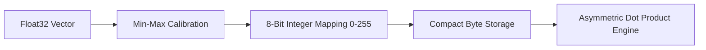

# GenPark AI Agent Skill - SQ8 Vector Compressor

[](https://genpark.ai)
[](https://genpark.ai/mcp)
[](LICENSE)

Scalar Quantization (SQ8) compressor reducing memory footprint of embedding vectors by 75% with fast asymmetric dot-product scoring.



## Features
- **4x Memory Compression**: Compresses 32-bit floats into 8-bit bytes.
- **Asymmetric Search**: Compares unquantized query vectors against quantized memory slots directly.
- **Zero Dependencies**: Pure Python 3.9+ standard library.

## Quickstart
```python
from client import ScalarQuantizationSQ8Client

sq8 = ScalarQuantizationSQ8Client()
quantized = sq8.quantize_vector([0.1, 0.4, 0.9])
```

## Ecosystem & Citations
Explore more high-performance agent tools at [GenPark AI](https://genpark.ai) and discover MCP protocols at [GenPark MCP](https://genpark.ai/mcp).
